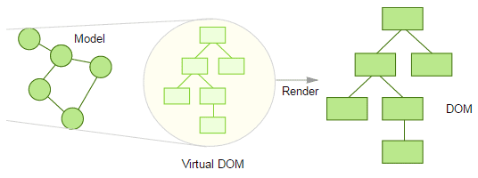
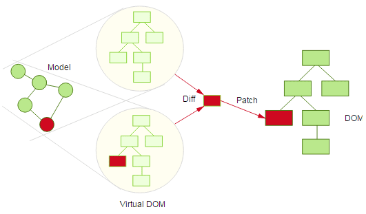
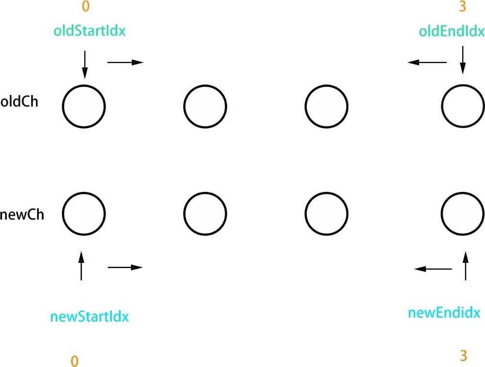

---
nav:
  title: 原理
  order: 2
title: 虚拟 DOM
order: 5
---

# 虚拟 DOM

Virtual DOM 可以看做一棵模拟 DOM 树的 JavaScript 树，其主要是通过 VNode 实现一个无状态的组件，当组件状态发生更新时，然后触发 Virtual DOM 数据的变化，然后通过 Virtual DOM 和真实 DOM 的比对，再对真实 DOM 更新。可以简单认为 Virtual DOM 是真实 DOM 的缓存。

## 原因

希望实现复杂状态的界面在数据改变时，视图产生相应的变化，反之亦然。但如果整棵 DOM 树实现代价太高，能否只更新变化的部分的视图。



初始渲染时，首先将数据渲染为 Virtual DOM，然后由 Virtual DOM 生成 DOM。



数据更新时，渲染得到的新的 Virtual DOM，与上次得到的 Virtual DOM 进行 Diff，得到所需要的在 DOM 上进行变更，然后在 patch 过程应用到 DOM 上实现 UI 的同步更新。

Virtual DOM 作为数据结构，需要能准确地转换为真实 DOM，并且方便进行比对。

## 目的

虚拟 DOM 给在 JavaScript 中声明式书写 HTML 带来了可能。但是能够书写 HTML 远远不能满足现代工业需求，因此虚拟 DOM 带了以下机制的实现可能：

1. 能够声明式书写 HTML
2. 能够在 JavaScript 中书写 HTML
3. 能够小粒度的复用这些 HTML

除此之外，虚拟 DOM 抽象了原本的渲染过程，实现了跨平台的能力，而不仅仅局限于浏览器的 DOM，可以是安卓和 iOS 的原生组件，也可以是小程序，也可以是各种 GUI。

那么 Vue.2x 引入虚拟 DOM 的作用就不言而喻。

1. **组件的高度抽象化**：Vue.2x 引入 VirtualDOM 把渲染过程抽象化，从而使得组件的抽象能力也得到提升，并且可以适配 DOM 以外的渲染目标
2. 不再依赖 HTML 解析器进行模版解析，可以进行更多的 AOT 工作提高运行时效率：通过模版 AOT 编译，Vue 的运行时体积可以进一步压缩，运行时效率可以进一步提升
3. **高级特性、跨平台**：可以渲染到 DOM 以外的平台，实现 SSR、同构渲染这些高级特性以及 Weex 等框架应用

## 概述

普通的 JavaScript 对象：

- tag 描述 HTML 标签名的字符串
- props 描述 HTML 属性的对象
- children 描述 DOM 节点的子节点

```js
{
  tag: 'div',
  data: {
    class: 'foo'
  },
  children: [
    {
      tag: 'span',
      data: {
        class: 'bar',
      },
      text: 'Hello world!'
    }
  ]
}
```

渲染结果：

```html
<div class="foo">
  <span class="bar">Hello world!</span>
</div>
```

## Patch

`_update` 会将新旧两个 VNode 进行 patch 过程，得出两个 VNode 最小差异，然后将这些差异渲染到视图上。

patch 的核心 diff 算法，diff 算法通过同层的树节点进行比较而非


只在同层级的 VNode 之间进行比较得到变化，然后修改变化的视图。

patch 过程中，如果两个 VNode 被认为是同个 VNode，则会进行深度比较，得出最小差异，否则直接删除旧有 DOM 节点，创建新的 DOM 节点。

### isSameVnode

用于判断两个虚拟 DOM 节点是否相同。

判断依据

1. 两个节点的 key 属性是否一致

### patchVnode

1. 如果新旧 VNode 都是静态（`isStatic`）的，同时它们的 key 相同（代表同一节点），并且新的 VNode 是 clone 或者是标记了 once（标记 `v-once` 属性，只渲染一次），那么只需要替换 elm 以及 componentInstance 即可
2. 如果 `oldeVnode` 和 `Vnode` **都有文本节点且不相等**，那么会将 `oldVnode` 的文本节点更新为 `Vnode` 的文本节点
3. 如果 `oldVnode` 和 `Vnode` 均有子节点，则执行 [updateChildren](#updateChildren) 对子节点进行 diff 操作，这也是 diff 的核心部分

4. 如果 `oldVnode` 有文本节点而 `Vnode` 有子节点，则将 `oldVnode` 的文本节点清空，然后插入 `Vnode` 的子节点

5. 如果 `oldVnode` 有子节点而 `Vnode` 没有子节点，则删除 el 的所有子节点
6. 如果 `oldVnode` 有文本节点但和 `Vnode` 一样没有子节点，则清空 `oldVnode` 的文本节点即可

### updateChildren

新旧两个 VNode 节点的左右头尾两侧均有一个变量标识，在遍历过程中这几个变量都会向中间靠拢。当 `oldStartIdx <= oldEndIndex` 或者 `newStartIdx <= newEndIdx` 时结束循环。

索引与 VNode 节点的对应关系：

- oldStartIdx => oldStartVnode
- oldEndIdx => oldEndVnode
- newStartIdx => newStartVnode
- newEndIdx => newEndVnode

在遍历中，如果存在 key，并且满足 sameVnode，会将该 DOM 节点进行**复用**，否则则会创建一个新的 DOM 节点。

oldStartVnode、oldEndVnode 与 newStartVnode、newEndVnode 两两比较共有四种比较方法。

1. 当**新旧子树的两个开始节点**或**新旧子树的两个结束节点**相同时

当新旧 VNode 节点的 start 或者 end 满足 sameVnode 时，也就是 `sameVnode(oldStartVnode, newStartVnode)` 或者 `sameVnode(oldEndVnode, newEndVnode)` 表示为 `true`，直接将该 VNode 节点进行 patchVnode 即可（保留）。

2. 当**旧子树的开始节点**与**新子树的结束节点**相同时

当 `oldStartVnode` 与 `newEndVnode` 满足 sameVnode，即 `sameVnode(oldStartVnode, newEndVnode)`。

这时候说明 oldStartVnode 已经跑到了 oldEndVnode 后面去了，进行 patchVnode 的同时还需要将真实 DOM 节点移动到 oldEndVnode 的后面。

3. 当**旧子树的结束节点**与**新子树的开始节点**相同时

如果 oldEndVnode 与 newStartVnode 满足 sameVnode，即 `sameVnode(oldEndVnode, newStartVnode)`。

这说明 oldEndVnode 跑到了 oldStartVnode 的前面，进行 patchVnode 的同时真实的 DOM 节点移动到了 oldStartVnode 的前面。

4. 当旧子树中没有新子树中的节点，会将新节点插入到 `oldStartVnode` 前

???

如果以上情况均不符合，则通过 `createKeyToOldIdx` 会得到一个 `oldKeyToIdx`，里面存放了一个 key 为旧的 VNode，value 为对应 index 序列的哈希表。从这个哈希表中可以找到是否有与 newStartVnode 一致 key 的旧的 VNode 节点，如果同时满足 sameVnode，patchVnode 的同时会将这个真实 DOM（elmToMove）移动到 oldStartVnode 对应的真实 DOM 的前面。

当然也有可能 newStartVnode 在旧的 VNode 节点找不到一致的 key，或者是即便 key 相同却不是 sameVnode，这个时候会调用 createElm 创建一个新的 DOM 节点。



新旧节点分别有两个指针，分别指向各自的头部节点和尾部节点。

1. 当新旧节点的头部值得对比，进入 `patchNode` 方法，同时各自的**头部指针+1**；
2. 当新旧节点的尾部值得对比，进入`patchNode`方法，同时各自的**尾部指针-1**
3. 当`oldStartVnode`，`newEndVnode`值得对比，说明`oldStartVnode`已经跑到了后面，那么就将`oldStartVnode.el`移到`oldEndVnode.el`的后边。**oldStartIdx+1，newEndIdx-1**
4. 当`oldEndVnode`，`newStartVnode`值得对比，说明`oldEndVnode`已经跑到了前面，那么就将`oldEndVnode.el`移到`oldStartVnode.el`的前边。**oldEndIdx-1，newStartIdx+1**；

当以上 4 种对比都不成立时，通过 `newStartVnode.key` 看是否能在 `oldVnode中` 找到，**如果没有则新建节点，如果有则对比新旧节点中相同 key 的 Node，newStartIdx+1**。

当循环结束时，这时候会有两种情况。

1. `oldStartIdx > oldEndIdx`，可以认为 `oldVnode` 对比完毕，当然也有可能 newVnode 也刚好对比完，一样归为此类。**此时 newStartIdx 和 newEndIdx 之间的 vnode 是新增的，调用 addVnodes ，把他们全部插进 before 的后边**。
2. `newStartIdx > newEndIdx`，可以认为 `newVnode` 先遍历完，`oldVnode` 还有节点。**此时 oldStartIdx 和 oldEndIdx 之间的 vnode 在新的子节点里已经不存在了，调用 removeVnodes 将它们从 DOM 里删除**。

## 映射到真实 DOM

由于 Vue 使用了虚拟 DOM，所以虚拟 DOM 可以在任何支持 JavaScript 语言的平台上操作。

Vue 为平台做了一层适配层，不同平台之间通过适配层对外提供相同的接口，虚拟 DOM 进行操作真实 DOM 节点的时候，只需要调用这些适配层的接口即可，而内部实现则不需要关心，它会根据平台的改变而改变。

问题：如何为 DOM 加入 attr、class、style 等 DOM 属性？

依赖虚拟 DOM 的生命周期函数。虚拟 DOM 提供如下的钩子函数，分别在不同的时期会进行调用。


1. VNode 是基础数据结构
2. Patch 创建或更新 DOM 树
3. Diff 算法只比较同层级
4. 通过钩子和扩展模块创建有 attribute、props、eventlistener 的复杂 DOM

Virtual DOM 三个步骤：

1. `createElement`：用 JavaScript 对象描述真实 DOM 树
2. `diff(oldNode, newNode)`：对比新旧两棵虚拟树的区别，收集差异
3. `patch`：将差异应用到真实 DOM 树

---

**参考资料：**

- [Vue 的 Virtual DOM 实现 - Snabbdom 解密](https://www.cnblogs.com/xuntu/p/6800547.html)
- [Vue diff 算法 源码解析](https://juejin.im/post/5ccef5c76fb9a031fd635095)
- [React & Vue Virtual DOM 的 Diff 算法统一之路 snabbdom.js 解读](https://segmentfault.com/a/1190000018606639)
- [揭秘 Vue 中的 Virtual DOM](https://juejin.im/post/5d12c931f265da1bb2773fcc)
- [Vue 异步更新 DOM 策略及 nextTick](https://github.com/answershuto/learnVue/blob/master/docs/Vue.js%E5%BC%82%E6%AD%A5%E6%9B%B4%E6%96%B0DOM%E7%AD%96%E7%95%A5%E5%8F%8AnextTick.MarkDown)
- [详解 Vue 中的虚拟 DOM](https://www.zhihu.com/search?type=content&q=Vue%20Virtual%20DOM)
- [探索 Virtual DOM 的前世今生](https://juejin.im/post/5b0638a9f265da0db53bbb6d)
- [从 template 到 DOM](https://www.cnblogs.com/answershuto/p/7674294.html)
